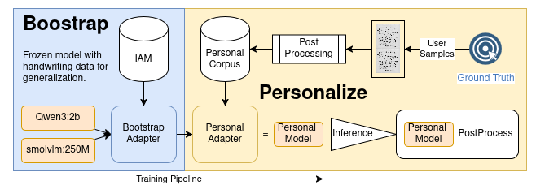

# _Disgraϕ_

[](https://colab.research.google.com/github/velocitatem/disgraPhi/blob/main/DisgraPhi_Personalization.ipynb)
[](https://www.python.org/downloads/)
[](https://opensource.org/licenses/MIT)

Handwriting recognition has come a long way, but it still struggles with the writing that matters most. People with dysgraphia and other handwriting difficulties often find that even the best OCR systems can't reliably read their work. This isn't surprising—these systems are trained on neat, consistent handwriting, not the varied and unconventional styles that real people actually write in.

DisgraPhi takes a different approach. Instead of trying to build one model that works for everyone, it learns your handwriting specifically. You provide a small sample of your writing, and the system fine-tunes itself to understand your unique style. The result is a personalized OCR model that actually works with how you write, not against it.

The system builds on modern vision-language models but keeps things practical. It's designed to run on consumer hardware and doesn't require massive datasets or expensive infrastructure. A few pages of your handwriting are enough to train a model that understands your writing better than any generic solution could.

This matters because between 5-20% of people struggle with handwriting in some way, and that number keeps growing. Whether it's dysgraphia, motor difficulties, or just unconventional penmanship, everyone deserves tools that work with their writing. DisgraPhi is a step toward making that happen.

## 🚀 Quick Start

### Try it in Google Colab (Easiest!)

The fastest way to get started - no installation required:

1. Click the "Open in Colab" badge above
2. Upload 10-30 images of your handwriting
3. Label what each image says
4. Train your personalized model (15-30 minutes)
5. Download and use your model

**Perfect for**: First-time users, quick experiments, no-code experience

See the [Colab Guide](COLAB_GUIDE.md) for detailed instructions.

### Install Locally

For development or production use:

```bash
# Clone the repository
git clone https://github.com/velocitatem/disgraPhi.git
cd disgraPhi

# Create virtual environment
make venv
source .venv/bin/activate

# Install package
pip install -e .
```

**Perfect for**: Developers, production deployment, batch processing

See [INSTALL.md](INSTALL.md) for detailed installation instructions.

## 📦 Features

- **🎯 Personalized OCR**: Train models on your unique handwriting style
- **🔧 Easy to Use**: One-click Colab notebook or simple CLI
- **⚡ Efficient**: Runs on free Google Colab or consumer GPUs
- **🧠 State-of-the-art**: Built on modern vision-language models (SmolVLM, Qwen3-VL, Florence2)
- **📊 Few-shot Learning**: Get good results with just 10-30 samples
- **🎨 Data Augmentation**: Smart augmentation for better generalization
- **📈 Training Monitoring**: TensorBoard integration for tracking progress
- **🌐 API Ready**: Deploy as REST API for production use

## 📖 Documentation

- **[Quick Start Guide](QUICKSTART.md)** - Get started in 5 minutes
- **[Colab Guide](COLAB_GUIDE.md)** - Complete Colab notebook instructions
- **[Installation Guide](INSTALL.md)** - Platform-specific setup
- **[Data Pipeline](ml/data/README.md)** - Data preparation and processing
- **[Contributing](CONTRIBUTING.md)** - How to contribute

## 🎯 Use Cases

- **Accessibility**: Help people with dysgraphia digitize their notes
- **Education**: Personalized homework grading and feedback
- **Medical**: Transcribe doctor's notes and prescriptions
- **Research**: Analyze historical handwritten documents
- **Personal**: Digitize journals, recipes, and letters
- **Business**: Process handwritten forms and documents

## 🏗️ Architecture

DisgraPhi uses a two-stage training approach:

1. **Bootstrap Training**: Pre-train on IAM Handwriting Database (13k+ samples)
2. **Personalization**: Fine-tune on user-specific samples (10-100+ samples)

The system uses LoRA (Low-Rank Adaptation) for efficient fine-tuning, allowing personalization with minimal compute and data.

### Supported Models

- **SmolVLM-256M** (recommended for Colab): Fast, efficient, good accuracy
- **Qwen3-VL-2B**: Better accuracy, requires more compute
- **Florence2-Base**: Alternative architecture, good for specific tasks

## 💡 Examples

### Train with Colab

Just click the badge at the top and follow the interactive notebook!

### Collect Data with Gradio Webapp

```bash
# Run interactive data collector
python apps/webapp-minimal/app.py

# Opens a webapp that:
# - Prompts you with practice sentences
# - Captures photos from webcam or uploads
# - Guides bounding box annotation
# - Exports ready-to-use dataset ZIP
```

### Train Locally

```bash
# After collecting data with Gradio webapp or manually
# Train personalized model
disgraphi-train \
    --dataset_type manifest \
    --manifest_data_dir path/to/your/dataset \
    --model_provider smolvlm-256m \
    --num_train_epochs 5 \
    --output_dir ./models
```

### Use in Python

```python
from ml.models.providers import create_model
from PIL import Image

# Load personalized model
model = create_model("smolvlm-256m")
model.load_adapter("path/to/adapter")

# Transcribe handwriting
image = Image.open("handwriting.jpg")
text = model.generate(
    pixel_values=image,
    prompt="Transcribe this handwritten text.",
    max_new_tokens=128
)
print(text)
```

### Deploy as API

```bash
export ML_ADAPTER_PATH="path/to/adapter"
export ML_MODEL_NAME="smolvlm-256m"

python ml/inference.py
```

Access at `http://localhost:8000/docs`

## 🧪 Performance

Expected accuracy with proper samples:

| Samples | Character Error Rate | Word Error Rate |
|---------|---------------------|-----------------|
| 10-15   | 15-25%             | 25-40%          |
| 20-30   | 8-15%              | 15-25%          |
| 40-60   | 5-10%              | 10-18%          |
| 100+    | 2-5%               | 5-12%           |

*Lower is better. Results vary by handwriting style and quality.*

## 🤝 Contributing

We welcome contributions! See [CONTRIBUTING.md](CONTRIBUTING.md) for guidelines.

Areas we need help with:
- Testing with diverse handwriting styles
- Improving documentation
- Adding new model architectures
- Optimizing performance
- Translating to other languages

## 📄 License

MIT License - see [LICENSE](LICENSE) for details.

## 🙏 Acknowledgments

- **IAM Handwriting Database** for bootstrap training data
- **Hugging Face** for model hosting and transformers library
- **Vision-language model creators** (SmolVLM, Qwen, Florence2)
- **Contributors** who help improve DisgraPhi

## 📞 Support

- **Documentation**: Check the guides linked above
- **Issues**: [GitHub Issues](https://github.com/velocitatem/disgraPhi/issues)
- **Discussions**: [GitHub Discussions](https://github.com/velocitatem/disgraPhi/discussions)

## 🗺️ Roadmap

- [ ] PyPI package release
- [ ] Web-based labeling interface
- [ ] Multi-language support
- [ ] Mobile app for data collection
- [ ] Continuous learning from corrections
- [ ] Confidence scores for predictions
- [ ] Batch processing optimizations

---

**Made with ❤️ for everyone who struggles with handwriting**

